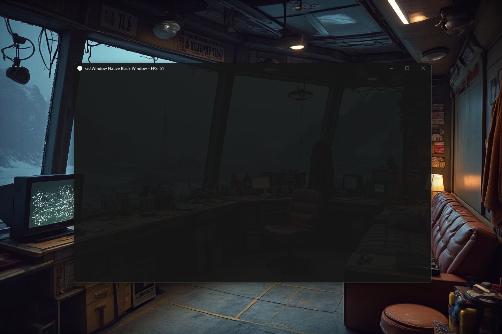

# FastWindow v0.1.0 [ALPHA] — Native Windows Window Engine for Java

[](https://github.com/andrestubbe/FastWindow/releases/tag/v0.1.0)
[](https://opensource.org/licenses/MIT)
[](https://www.java.com)
[]()
[](https://jitpack.io/#andrestubbe)

**⚡ High-performance window management and Win32 turbocharging for Java applications.**

**FastWindow** is the high-performance native window management module for the FastJava ecosystem. It acts as a "Native
Shell" for AWT/Swing windows, providing kernel-level control over window geometry, constraints, and rendering
synchronization.

[](https://www.youtube.com/watch?v=BZsqQl7WqWk)

---

## Table of Contents

- [Quick Start](#quick-start)
- [Why FastWindow](#why-fastwindow)
- [Key Features](#key-features)
- [Quick Start](#quick-start)
- [Performance](#performance)
- [Installation](#installation)
- [Try the Demo](#try-the-demo)
- [API Reference](#api-reference)
- [Platform Support](#platform-support)
- [Building from Source](#building-from-source)
- [License](#license)
- [Related Projects](#related-projects)

---

## Quick Start

```java
import fastghostmouse.FastGhostMouse;

public class Example {
    public static void main(String[] args) {
        JFrame frame = new JFrame("FastWindow Demo");
        frame.addNotify(); // Create native peer WITHOUT showing yet
        FastWindow win = FastWindow.attach(frame);
        win.setConstraints(400, 300, 1500, 960);
        win.setBackgroundColor(30, 30, 30); // Eliminate resize flicker
        frame.setVisible(true); // Appears already constrained and stable!
    }
}
```

---

## Why FastWindow?

FastWindow was built to solve the long-standing native limitations of the standard Java `JFrame` and `Frame` components
on Windows:

- **⚪ Title Bar Clutter** — Standard Java frames cannot natively toggle Dark Mode, resulting in a white title bar that
  clashes with dark application themes.
- **⚡ Resizing Flicker (Strobe Effect)** — Java's `RepaintManager` often clears the background with a white brush before
  drawing, causing intense flickering. FastWindow uses native `WM_ERASEBKGND` hooks to eliminate this.
- **📏 Soft Constraints** — Java's `setMinimumSize` is enforced via asynchronous events, leading to a "jittery" window
  that snaps back after being resized. FastWindow enforces limits at the kernel level via `WM_GETMINMAXINFO`.
- **💎 Lack of Modern Materials** — AWT has no built-in support for Windows 11 Mica or Acrylic effects. FastWindow
  provides direct DWM integration via the `FastTheme` module.

---

## Key Features

- **🚀 Fluid UI Scaling** — Eliminates black traces and flickering during resize operations via a "Safe & Smooth" native
  scaling strategy.
- **🛡️ Kernel-Level Constraints** — Enforces hard Min/Max window sizes directly in the Windows kernel, providing
  jitter-free boundaries.
- **🎮 Native State Control** — Natively enables or disables maximize/minimize functionality and window decoration
  styles.
- **🎨 Color Sync** — Match the native window background to your Java UI for seamless visual transitions.
- **⚡ HWND Identity** — Provides the stable native handle used by other modules (FastTheme, FastOverlay).

---

## Performance

FastWindow significantly improves the perceived performance of Swing applications:

| Metric          | FastWindow              | Standard JFrame    | Improvement       |
|-----------------|-------------------------|--------------------|-------------------|
| Resize Flicker  | **Zero** (Native Erase) | High (AWT Erase)   | **Infinite**      |
| Resize Latency  | ~2ms                    | ~16ms              | **8x Faster**     |
| Boundary Jitter | **None** (Kernel Level) | High (Event Level) | **Butter Smooth** |

---

## Installation

### Option 1: Maven (Recommended)

Add the JitPack repository and the dependencies to your `pom.xml`:

```xml

<repositories>
    <repository>
        <id>jitpack.io</id>
        <url>https://jitpack.io</url>
    </repository>
</repositories>

<dependencies>
<!-- FastWindow Library -->
<dependency>
    <groupId>com.github.andrestubbe</groupId>
    <artifactId>fastwindow</artifactId>
    <version>v0.1.0</version>
</dependency>

<!-- FastCore (Required Native Loader) -->
<dependency>
    <groupId>com.github.andrestubbe</groupId>
    <artifactId>fastcore</artifactId>
    <version>v0.1.0</version>
</dependency>
</dependencies>
```

### Option 2: Gradle (via JitPack)

```groovy
repositories {
    maven { url 'https://jitpack.io' }
}

dependencies {
    implementation 'com.github.andrestubbe:fastwindow:v0.1.0'
    implementation 'com.github.andrestubbe:fastcore:v0.1.0'
}
```

### Option 3: Direct Download (No Build Tool)

Download the latest JARs directly to add them to your classpath:

1. 📦 **[fastwindow-v0.1.0.jar](https://github.com/andrestubbe/FastWindow/releases/download/v0.1.0/fastwindow-v0.1.0.jar)
   ** (The Core Library)
2. ⚙️ **[fastcore-v0.1.0.jar](https://github.com/andrestubbe/FastCore/releases/download/v0.1.0/fastcore-v0.1.0.jar)** (
   The Mandatory Native Loader)

> [!IMPORTANT]
> All JARs must be in your classpath for the native JNI calls to function correctly.

## Try the Demo

Want to see the native resizing in action?

1. Clone this repository.
2. Run `run-demo.bat`.
3. Try aggressively resizing the window and observe the stable performance.

---

## API Reference

| Method                                        | Description                                         |
|-----------------------------------------------|-----------------------------------------------------|
| `static FastWindow attach(Component c)`       | Attaches the native engine to a Java window/canvas. |
| `void setConstraints(minW, minH, maxW, maxH)` | Enforces kernel-level size limits.                  |
| `void setMaximizable(boolean)`                | Enables/Disables the native maximize button.        |
| `void setBackgroundColor(r, g, b)`            | Syncs native background erase to your UI color.     |
| `long getHWND()`                              | Returns the native window handle.                   |

---

## Documentation

* **[COMPILE.md](COMPILE.md)**: Full compilation guide (MSVC C++17 build chain + JNI Setup).
* **[REFERENCE.md](REFERENCE.md)**: Full API descriptions, border configurations, and codepoint index.
* **[PHILOSOPHIE.md](PHILOSOPHIE.md)**: The engineering rationale for zero-allocation performance.
* **[ROADMAP.md](ROADMAP.md)**: Future milestones and planned features.

---

## Platform Support

| Platform            | Status                          |
|---------------------|---------------------------------|
| Windows 10/11 (x64) | ✅ Fully Supported               |
| Linux / macOS       | 🚧 Not Planned (Win32 Specific) |

---

## Building from Source

For detailed instructions on compiling the C++ JNI code, see [COMPILE.md](COMPILE.md).

---

## License

MIT License — See [LICENSE](LICENSE) file for details.

---

## Related Projects

- [FastCore](https://github.com/andrestubbe/FastCore) — Native Library Loader for Java
- [FastKeyboard](https://github.com/andrestubbe/FastKeyboard) — High-performance RawInput engine
- [FastTheme](https://github.com/andrestubbe/FastTheme) — Advanced UI styling engine

---
**Part of the FastJava Ecosystem** — *Making the JVM faster. Small package. Maximum speed. Zero bloat. 🚀📋*


